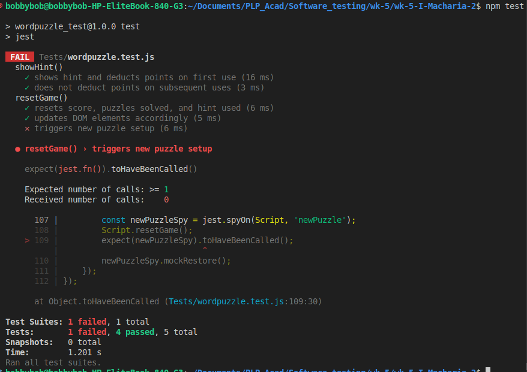
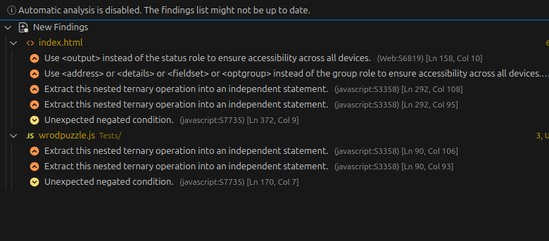

# 🧪 Final Group Test Report Template — Word Puzzle Game Plus

**Level:** Intermediate QA | **Week 5:** Test Management

**Course:** Software Testing & Quality Assurance  
**Module:** Test Management (Week 5)  
**Project Type:** Group Assessment  
**Submission Date:** 2025-10-28

## Team Information

| Role | Name | Responsibilities |
|------|------|------------------|
| Test Manager | Ian Macharia| Planning, scheduling, coordination, metric tracking |
| Risk Analyst | Mark Mwangi| Risk identification, prioritization, test design linkage |
| Test Executor | Shanice Chepkwony| Execution, evidence capture, defect logging |

## Project Overview

**System Under Test:** Word Puzzle Game Plus  
**Technology Stack:** HTML, CSS, JavaScript  
**Environment:** Chrome Browser (Desktop)

### Features Under Test

| Feature | Description | Risk Category |
|---------|-------------|---------------|
| Reset Game | Clears score and progress instantly | |
| Leaderboard | Stores top 3 scores in localStorage | |
| Bonus Round | Every 3 puzzles → doubles score | |

## Test Plan

### Objectives

- Test whether the site works as intended. Do each of the different functions work? for example: Buttons for `Submit`, `Hint`, `New Puzzle`,
and `reset`; Does the `Leaderboard` keep score as advertised
- Test whether the site work across different devices, i.e `Responsiveness`
- Test whether the jumbled word repeats itself, and after how long.

### Scope

**In Scope:**
- Button Functionality.
- Accessibility over different devices. 

**Out of Scope:**
- Test the bonus count against points awarded.
- Test the Hint button for point deduction.

### Tools & Resources

- Use SonarQube to identify code defects.
- Use JestDom to test individual functions.
- [Responsiveness_Tool](https://responsivetesttool.com/)

### Schedule

| Phase | Planned Duration | Actual Duration | Status |
|-------|------------------|-----------------|--------|
| Phase One: Identify Resources and allocate duties.|Sunday 26th OCT,2025, between 2000 - 2100 |Sunday 26th OCT,2025, between 2100 - 2200|Completed |
| Phase Two: Review Test plan and risk analysis|Monday 27th OCT,2025, between 1300 - 1400 |Monday 27th OCT,2025,between 2100 - 2130|Completed |
| Phase Three: Design Test suites and execution|Monday 27th OCT,2025, between 2000 - 2100 |Monday 27th OCT,2025, between 2130 - 2200 |Completed |
| Phase Four: Post-Mortem and Test Exit criteria met|Tuesday 28th OCT,2025, between 1300 - 1400 || |

## Risk Analysis
A risk analysis was performed on the new features to identify potential failures. Risks are rated on **Likelihood (L)** and **Impact (I)** . **Priority (P)** is L * I.

| ID | Feature | Risk Description | Likelihood | Impact | Priority | Mitigation Strategy (Test Focus) |
|----|-------|---------|--------|------|--------| -------|
| **R-01** | Bonus Round | **Functional:** The `score *= 2` logic is applied *before* the points for the 3rd puzzle are added, or it triggers on the wrong puzzle number (e.g., #2 or #4). | High | High | **High** | Design multi-step test cases to solve puzzles 1, 2, and 3, recording the score at each step to validate the exact bonus calculation. |
| **R-02** | Reset Game | **State/Usability:** The "Reset" button clears the score but does *not* load a new puzzle, leaving the game in an unplayable "limbo" state until the user *also* clicks "New Puzzle". | High | High | **High** | Perform flow testing on the "Reset" button, verifying the game state immediately after reset and the number of clicks required to play again. |
| **R-03** | Leaderboard | **Compatibility:** `localStorage` fails to write or read in private/incognito browsing modes, or on different browsers (e.g., Firefox, Edge), causing the leaderboard to fail. | Low | High | **High** | Execute all leaderboard test cases (sorting, boundaries) in a secondary environment (e.g., Chrome Incognito) to verify data persistence. |
| **R-04** | Leaderboard | **Functional:** The leaderboard fails at its boundary, either failing to replace the 3rd-place score with a new, higher score, or incorrectly saving 4 scores. | Low | High | **High** | Design a specific boundary test: achieve scores (10, 20, 30), then achieve a 4th score (e.g., 40) and a 5th score (e.g., 5) to validate the `slice(0,3)` logic. |
| **R-05** | Leaderboard | **Functional:** Scores are sorted alphabetically (e.g., `100` < `20`) instead of numerically, or in ascending order instead of descending. | Low | High  | **Medium** | Design a test case using scores that would fail a string-sort (e.g., 100, 5, 20) and verify the final order is `100, 20, 5`. |
| **R-06** | Game Core | **Non-Functional (UX):** The `newPuzzle()` function picks words randomly with no memory, allowing the same puzzle to be shown multiple times in a row, leading to poor user experience. | High | Low  | **Medium** | **(DEFERRED)** - This is a valid UX issue, but due to its low impact on core functionality, it is deferred to prioritize the high-risk functional features. |
| **R-07** | Responsiveness | **Non-Functional (UX):** The game should be availabke for play across different devices. | Low | medium | **Medium** | **(DEFERRED)** - Check whether the website behaves on different devices, i.e Tablets, mobile, or TV.|

### Risk Coverage
Based on the prioritization, the team has agreed to **defer testing for R-06** to focus all resources on the High and Medium-priority functional risks.

- Tested Risks Percent: 
R-01, R-02, R-03, R-04, R-05  
-  Deferred Risks: R-06

- Untested Risks Percent: (5 Tested Risks / 6 Total Risks) = **83.3%** 

## Test Cases

| ID | Feature | Objective | Expected Result | Actual Result | Status | Risk Link |
|----|----------|------------|-----------------|----------------|---------|------------|
| **TC-01** | Bonus Round | Risk-Based (R-01 High): Validate score doubling occurs after the points for the 3rd puzzle are added. | Solve 3 puzzles (10 pts each). Score after puzzle 1: 10. After puzzle 2: 20. After puzzle 3 (Bonus): (20+10)×2=60. |  |  | R-01 |
| **TC-02** | Reset Game | Risk-Based (R-02 High): Verify that clicking "Reset" leaves the game in an unplayable "limbo" state. | Click "Reset Game". Actual Result: Score is 0, Solved is 0. Scrambled word/hint area is blank. Expected Failure: The user must also click "New Puzzle" to start a game. |  |  | R-02 |
| **TC-03** | Leaderboard | Risk-Based (R-03 High): Verify data persistence of the leaderboard in Incognito/Private mode. | In Chrome Incognito, achieve a score of 10. Close and reopen a new Incognito window. The score (10) should not be present on the leaderboard. |  |  | R-03 |
| **TC-04** | Leaderboard | Risk-Based (R-04 High): Validate boundary logic: only top 3 scores are kept, and a new high score replaces the lowest of the 3. | Enter scores: 10, 20, 30. Leaderboard: 30, 20, 10. Enter score 40. Leaderboard: 40, 30, 20 (10 is removed). Enter score 5. Leaderboard: 40, 30, 20 (5 is ignored). |  |  | R-04 |
| **TC-05** | Leaderboard | Risk-Based (R-05 Medium): Verify scores are sorted numerically in descending order, not alphabetically. | Enter scores 100, 5, and 20. The leaderboard must display: 100, 20, 5. (Alphabetical would be: 100, 20, 5 or 5, 20, 100 if the logic fails to compare number strings correctly). |  |  | R-05 |
| **TC-06** | Game Core | Negative Test: Submit a guess with leading/trailing whitespace. | Enter guess ' word ' (with spaces) for the word word. The guess should be correctly validated after trimming, resulting in a Correct! message and score update. |  |  |  |
| **TC-07** | Game Core | Negative Test: Submit an incorrect guess when a puzzle is active. | Enter an incorrect word (e.g., 'table') when a puzzle is displayed. Score and solved count must remain unchanged. Message: "Incorrect, try again!" and input field is selected for re-entry. |  |  |  |
| **TC-08** | Usability | Usability Test: Confirm keyboard shortcut and input focus behavior for efficient play. | On page load, the input field should automatically gain focus. Hitting the Enter key while the input field is focused should trigger the checkGuess function. |  |  |  |
| **TC-09** | Responsiveness | Responsiveness Test: Confirm thhe website behaves as expected  acrross different screen sizes. | The UI should still display both game section and leaderboard in the expected behavior irregardless of the screen size. |  |  |  |

## Defects

| ID | Issue Title | Severity | Risk ID | Status | GitHub Link |
|----|-------------|----------|---------|--------|-------------|
| |There is no call to `newPuzzle()` inside this function.  ||**TC-02** - **R-02** | | |
| | | | | | |
| | | | | | |
| | | | | | |

## Metrics

- Test Case Pass Percent: 
- Defect Density: 
- Risk Coverage Percent: 
- Regression Success Rate: 

### Defect Summary

- Total Defects Logged: 
- Critical High: 
- Fix Rate: 

## Test Control & Project Management

### Phases

| Phase | Deliverable | Actual Output | Variance | Owner |
|-------|-------------|---------------|----------|-------|
|Phase One:|Identify Resources and allocate duties.|All duties allocated and testing team is aligned | Time to meet had to be moved. |Ian Macharia |
|Phase Two:|Review Test plan and risk analysis |Testers were not available at allocated time. |**(DEFERRED)** Time to meet had to be moved. |Ian Macharia & Mark Mwangi |
|Phase Three:|Design Test suites and execution | All testers are available and testing started on time. |Risk analysis was accpeted and test cases approved for development and execution. | Shanice Chepkwony, Ian Macharia & Mark Mwangi |
|Phase Four:|Post-Mortem and Test Exit criteria met | | | |

**Progress Tracking Method:**  
**Change Control Notes:**

## Lessons Learned

- Most Defect Prone Feature: 
- Risk Analysis Impact: 
- Team Communication Effectiveness: 
- Improvements for Next Cycle: 

## Attachments

- |findings from Sonarqube ||

## Sign Off

| Name | Role | Initials | Date |
|------|------|-----------|------|
|Ian Macharia | Test Manager | | |
|Mark Mwangi | Risk Analyst | | |
|Shanice Chepkwony | Test Executor | | |

## Overall Summary

**Statement:** 

**Test Status:** ☐ Completed / ☐ In Progress / ☐ Deferred

